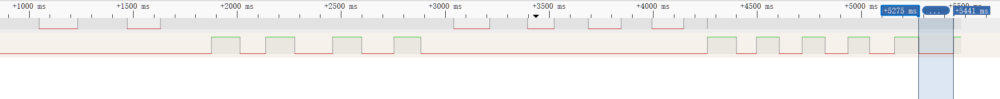
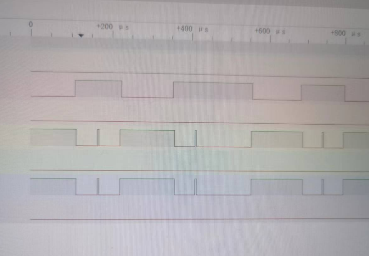

# 任务5设计

## 按键行为

根据多次测试,按键单次约在100-200ms的范围内,以此作为基础,进行之后的逻辑设计

根据我的逻辑分析仪(80MHz)观察,并没有发现比较明显的抖动,参考老师的数据,可以将抖动时长控制在5ms,

## 扫描信息

| 按下的按键 | 第一次扫描(1111) | 第二次扫描(1110) | 第三次扫描(1101) | 第四次扫描(1011) | 第五次扫描(0111) |
| ---------- | ---------------- | ---------------- | ---------------- | ---------------- | ---------------- |
| 0          | 1111             | 1110             | 1101             | 1011             | 0111             |
| 1          | 1111             | 1100             | 1100             | 1011             | 0111             |
| 2          | 1111             | 1010             | 1101             | 1010             | 0111             |
| 3          | 1111             | 1110             | 1001             | 1001             | 0111             |
| 4          | 1111             | 0110             | 1101             | 1011             | 0110             |
| 5          | 1111             | 1110             | 0101             | 1011             | 0101             |
| 6          | 1111             | 1110             | 1101             | 0011             | 0011             |
| 7          | 1110             | 1110             | 1100             | 1010             | 0110             |
| 8          | 1101             | 1100             | 1101             | 1001             | 0101             |
| 9          | 1011             | 1010             | 1001             | 1011             | 0011             |
| 10         | 0111             | 0110             | 0101             | 0011             | 0111             |

| 按下的按键 | 第1次扫描(1110) | 第2次扫描(1101) | 第3次扫描(1011) | 第4次扫描(0111) |
| ---------- | --------------- | --------------- | --------------- | --------------- |
| 10         | 0110            | 0101            | 0011            | 0111            |
| 4          | 0110            | 1101            | 1011            | 0110            |
| 9          | 1010            | 1001            | 1011            | 0011            |
| 2          | 1010            | 1101            | 1010            | 0111            |
| 1          | 1100            | 1100            | 1011            | 0111            |
| 8          | 1100            | 1101            | 1001            | 0101            |
| 5          | 1110            | 0101            | 1011            | 0101            |
| 3          | 1110            | 1001            | 1001            | 0111            |
| 7          | 1110            | 1100            | 1010            | 0110            |
| 6          | 1110            | 1101            | 0011            | 0011            |
| 0          | 1110            | 1101            | 1011            | 0111            |

## 实现方式

前两次分支使用的是查找表,为了加快逻辑判断的速度

## 利用逻辑分析仪快速调试,快速定位问题

