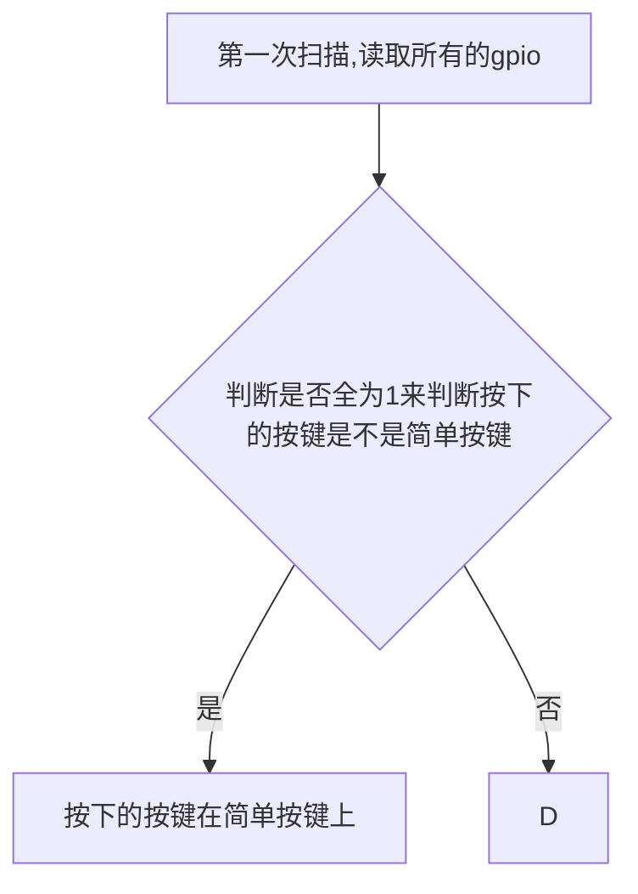

# 任务5设计

## 按键行为

根据多次测试,按键单次约在100-200ms的范围内,以此作为基础,进行之后的逻辑设计

根据我的逻辑分析仪(80MHz)观察,并没有发现比较明显的抖动,参考老师的数据,可以将抖动时长控制在5ms,

## 流程图

## 扫描信息

| 按下的按键 | 第一次扫描(1111) | 第二次扫描(1110) | 第三次扫描(1101) | 第四次扫描(1011) | 第5次扫描(0111) |
| ---------- | ---------------- | ---------------- | ---------------- | ---------------- | --------------- |
| 0          | 1111             | 1110             | 1101             | 1011             | 0111            |
| 1          | 1111             |                  |                  |                  |                 |
| 2          | 1111             |                  |                  |                  |                 |
| 3          | 1111             |                  |                  |                  |                 |
| 4          | 1111             |                  |                  |                  |                 |
| 5          | 1111             |                  |                  |                  |                 |
| 6          | 1111             |                  |                  |                  |                 |
| 7          | 0111             | 0110             | 0101             | 0011             | 0111            |
| 8          | 1011             | 1010             | 1001             | 1011             | 0011            |
| 9          | 1101             | 1100             | 1101             | 1001             | 0101            |
| 10         | 1110             | 1110             | 1101             | 1011             | 0111            |

