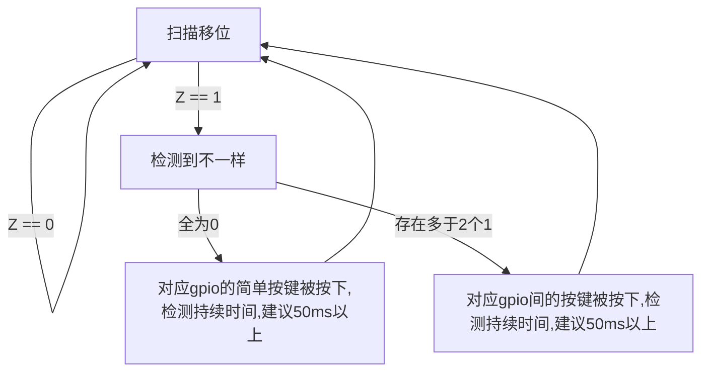

# 任务5设计

## 按键行为

根据多次测试,按键单次时常约在100-200ms的范围内,以此作为基础,进行之后的逻辑设计

根据我的逻辑分析仪(80MHz)观察,并没有发现比较明显的抖动,参考老师的数据,可以将抖动时长控制在5ms,

## 扫描逻辑

4个GPIO输出依次循环1000,0100,0010,0001,保持单次输出一个高电平,再次读入gpio输入,进行与输出的比较(异或,检测Z),如果是0000,说明是简单按键(接地)被按下,如果是多个(多于一个)高电平,证明,有相应输出高电平的按键与其他gpio间的按键被接通.

## 流程图

