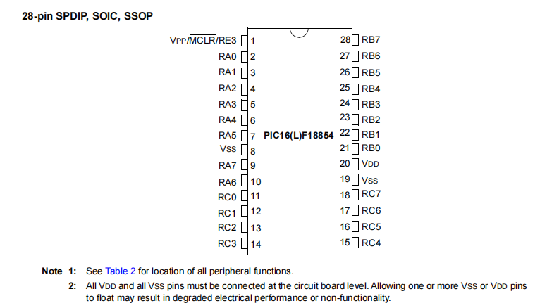

# 资料总结

## 脚位图



VDD:阳极

VSS:阴极

## 常用汇编语言

### 数据传输指令

1. **`MOVLW k`**
   - 含义：将立即数`k`加载到工作寄存器`WREG`。
   - 常用地方：初始化工作寄存器以备后续操作。
   - 示例：`MOVLW 0x07`

2. **`MOVWF f`**
   - 含义：将`WREG`中的值移动到寄存器`f`。
   - 常用地方：将工作寄存器的值存储到特定寄存器中。
   - 示例：`MOVWF PORTA`

3. **`MOVF f, d`**
   - 含义：将寄存器`f`的值移动到目标寄存器`d`中。
   - 常用地方：在寄存器之间传递数据。
   - 示例：`MOVF INDF0, W`

### 算术运算指令

4. **`ADDLW k`**
   - 含义：将立即数`k`加到工作寄存器`WREG`中。
   - 常用地方：进行简单的数值运算。
   - 示例：`ADDLW 0x05`

5. **`ADDWF f, d`**
   - 含义：将工作寄存器`WREG`的值加到寄存器`f`中，并将结果存储到目标寄存器`d`。
   - 常用地方：累加操作。
   - 示例：`ADDWF COUNT, F`

6. **`SUBLW k`**
   - 含义：将立即数`k`从工作寄存器`WREG`中减去。
   - 常用地方：进行简单的数值减法运算。
   - 示例：`SUBLW 0x05`

7. **`SUBWF f, d`**
   - 含义：将工作寄存器`WREG`中的值从寄存器`f`中减去，并将结果存储到目标寄存器`d`。
   - 常用地方：累减操作。
   - 示例：`SUBWF COUNT, F`

### 逻辑运算指令
8. **`ANDLW k`**
   - 含义：将立即数`k`与工作寄存器`WREG`的值进行逻辑与运算。
   - 常用地方：掩码操作。
   - 示例：`ANDLW 0x0F`

9. **`ANDWF f, d`**
   - 含义：将工作寄存器`WREG`的值与寄存器`f`的值进行逻辑与运算，并将结果存储到目标寄存器`d`中。
   - 常用地方：掩码操作。
   - 示例：`ANDWF PORTA, F`

10. **`IORLW k`**
    - 含义：将立即数`k`与工作寄存器`WREG`的值进行逻辑或运算。
    - 常用地方：设置特定位。
    - 示例：`IORLW 0x0F`

11. **`IORWF f, d`**
    - 含义：将工作寄存器`WREG`的值与寄存器`f`的值进行逻辑或运算，并将结果存储到目标寄存器`d`中。
    - 常用地方：设置特定位。
    - 示例：`IORWF PORTA, F`

12. **`XORLW k`**
    - 含义：将立即数`k`与工作寄存器`WREG`的值进行逻辑异或运算。
    - 常用地方：翻转特定位。
    - 示例：`XORLW 0xFF`

13. **`XORWF f, d`**
    - 含义：将工作寄存器`WREG`的值与寄存器`f`的值进行逻辑异或运算，并将结果存储到目标寄存器`d`中。
    - 常用地方：翻转特定位。
    - 示例：`XORWF PORTA, F`

### 控制指令
14. **`GOTO k`**
    - 含义：无条件跳转到程序存储器的`k`地址。
    - 常用地方：实现程序流程控制。
    - 示例：`GOTO START`

15. **`CALL k`**
    - 含义：调用子程序`k`，保存返回地址。
    - 常用地方：调用子程序。
    - 示例：`CALL DELAY`

16. **`RETURN`**
    - 含义：从子程序返回。
    - 常用地方：子程序结束后返回主程序。
    - 示例：`RETURN`

17. **`RETFIE`**
    - 含义：从中断返回，并使能全局中断。
    - 常用地方：中断服务程序结束时返回。
    - 示例：`RETFIE`

18. **`NOP`**
    - 含义：无操作，执行一个机器周期。
    - 常用地方：延时、占位。
    - 示例：`NOP`

### 位操作指令
19. **`BCF f, b`**（Bit Clear f）
    - 含义：清除寄存器`f`中第`b`位,清零.
    - 常用地方：复位特定位。
    - 示例：`BCF PORTA, 0`
20. **`BSF f, b`**（Bit Set f）
    - 含义：设置寄存器`f`中第`b`位,置1.
    - 常用地方：设置特定位。
    - 示例：`BSF PORTA, 0`

### 条件指令
22. **`BTFSC f, b`**
    - 含义：如果寄存器`f`中第`b`位清零，跳过下一条指令。
    - 常用地方：条件跳转。
    - 示例：`BTFSC PORTA, 0`

23. **`BTFSS f, b`**
    - 含义：如果寄存器`f`中第`b`位置位，跳过下一条指令。
    - 常用地方：条件跳转。
    - 示例：`BTFSS PORTA, 0`

### 数据移动指令
24. **`CLRF f`**
    - 含义：清除寄存器`f`的内容（将其设为0）。
    - 常用地方：初始化寄存器。
    - 示例：`CLRF PORTA`

25. **`CLRW`**
    - 含义：清除工作寄存器`WREG`的内容（将其设为0）。
    - 常用地方：初始化工作寄存器。
    - 示例：`CLRW`

`incfs` 和 `decfs` 是汇编语言中的指令，用于对寄存器或内存位置的值进行自增和自减操作。以下是它们的详细用法说明：

#### `incfs` 指令

`incfs` 指令对指定的寄存器或内存位置的值进行递增操作，并根据操作结果的零值状态（Z flag）更新状态寄存器。它的格式如下：

```
incfs f, d
```

- `f`：要递增的文件寄存器（地址）。
- `d`：目标位置，指定操作结果存储的位置。如果 `d` 为 0，结果存储在 W 寄存器中。如果 `d` 为 1，结果存储在 `f` 中。

#### 示例：

```assembly
incfs count1, 1 ; 将 count1 的值递增，并将结果存储在 count1 中
incfs count1, 0 ; 将 count1 的值递增，并将结果存储在 W 寄存器中
```

#### `decfs` 指令

`decfs` 指令对指定的寄存器或内存位置的值进行递减操作，并根据操作结果的零值状态（Z flag）更新状态寄存器。它的格式如下：

```
decfs f, d
```

- `f`：要递减的文件寄存器（地址）。
- `d`：目标位置，指定操作结果存储的位置。如果 `d` 为 0，结果存储在 W 寄存器中。如果 `d` 为 1，结果存储在 `f` 中。

#### 示例：

```assembly
decfs count1, 1 ; 将 count1 的值递减，并将结果存储在 count1 中
decfs count1, 0 ; 将 count1 的值递减，并将结果存储在 W 寄存器中
```

## 常用寄存器及其用法

### 常用寄存器

1. **WREG（工作寄存器）**
   - 用法：作为一个通用的工作寄存器，存储操作数和运算结果。
   - 示例：`MOVLW 0x07` (将立即数7加载到WREG)

2. **STATUS（状态寄存器）**
   - 用法：存储运算结果的状态信息，包括零位、进位位、数字进位位、掉电位、超时位，以及选择内存银行的RP0和RP1位。
   - 示例：`BCF STATUS, RP0` (清除RP0位，选择Bank 0)

3. **PORTA, PORTB, PORTC（端口寄存器）**
   - 用法：控制I/O引脚的状态，读写端口数据。
   - 示例：`MOVWF PORTA` (将WREG的值写入PORTA)

4. **TRISA, TRISB, TRISC（数据方向寄存器）**
   - 用法：设置I/O引脚的方向（输入或输出）。
   - 示例：`BCF TRISA, 0` (将PORTA的第0位设置为输出)

5. **FSR0L, FSR0H（文件选择寄存器）**
   - 用法：作为间接地址寄存器，用于间接访问数据存储器。
   - 示例：`MOVLW 0x07` `MOVWF FSR0L` (将立即数7加载到FSR0L)

6. **INDF0（间接寻址寄存器）**
   - 用法：通过FSR0L和FSR0H指向的地址进行数据访问。
   - 示例：`MOVF INDF0, W` (将FSR0指向的地址的值移动到WREG)

7. **PCL（程序计数器低位）**
   - 用法：控制程序流，通过修改PCL实现跳转。
   - 示例：`MOVLW 0x05` `MOVWF PCL` (跳转到程序计数器的地址5)

8. **PCLATH（程序计数器高位）**
   - 用法：存储程序计数器的高位，与PCL一起控制跳转地址。
   - 示例：`MOVLW 0x02` `MOVWF PCLATH` (设置程序计数器高位为2)

### 示例用法

#### 初始化和配置I/O引脚

```asm
; 初始化PORTA的第0位为输出，并设置其初始状态为低
BCF STATUS, RP0        ; 选择Bank 0
CLRF PORTA             ; 清除PORTA寄存器

BSF STATUS, RP0        ; 选择Bank 1
BCF TRISA, 0           ; 设置PORTA的第0位为输出

BCF STATUS, RP0        ; 回到Bank 0
```

#### 使用间接寻址访问数据

```asm
; 将立即数7存入一个地址
MOVLW 0x07
MOVWF FSR0L            ; 设置FSR0L寄存器
MOVLW 0x70
MOVWF FSR0H            ; 设置FSR0H寄存器

MOVLW 0x55
MOVWF INDF0            ; 通过FSR0指向的地址，将立即数0x55写入该地址
```

#### 控制LED点亮

```asm
; 设置RB0引脚为输出，并点亮LED
BCF STATUS, RP0        ; 选择Bank 0
CLRF PORTB             ; 清除PORTB寄存器

BSF STATUS, RP0        ; 选择Bank 1
BCF TRISB, 0           ; 设置RB0为输出

BCF STATUS, RP0        ; 回到Bank 0
BSF PORTB, 0           ; 设置RB0为高电平，点亮LED
```

### 使用状态寄存器进行条件判断

```asm
; 检查WREG是否为零
MOVLW 0x00
MOVWF WREG             ; 将WREG设置为0

BTFSC STATUS, Z        ; 检查零位，如果为零则跳过下一条指令
GOTO NotZero           ; 如果不为零，则跳转到NotZero
```

## 内存银行机制

       ### Bank机制详细说明

在PIC16(L)F18854微控制器中，内存被划分为32个银行（Bank），每个银行包含128字节的数据内存。这些内存银行包括核心寄存器、特殊功能寄存器（SFR）、通用用途RAM（GPR）和公共RAM。通过写入Bank选择寄存器（BSR）可以选择活动的银行。

### 内存银行

- **核心寄存器**：每个数据存储器银行的前12个地址。
- **特殊功能寄存器（SFR）**：核心寄存器后的20个字节。
- **通用用途RAM（GPR）**：最多80个字节。
- **公共RAM**：所有银行都可以访问的16个字节。

### Bank选择寄存器（BSR）

- BSR确定当前操作的银行。
- 通过将BSR设置为0x00到0x1F选择Bank 0到Bank 31。

### 详细的内存组织

- **公共RAM**：地址0x70到0x7F，可以从所有银行访问。
- **GPR和SFR**：根据BSR设置访问不同的银行。

### 切换到0和1以外的银行

要切换到0和1以外的银行，需要使用BSR选择所需的银行：

```assembly
; 例子：切换到Bank 5
MOVLW 0x05 ; 将Bank号加载到WREG
MOVWF BSR  ; 将WREG的值写入BSR，选择Bank 5
```

### 使用BSR进行银行切换的示例

1. **切换到Bank 2**：
   ```assembly
   MOVLW 0x02 ; 将Bank号2加载到WREG
   MOVWF BSR  ; 选择Bank 2
   ```

2. **访问Bank 2中的GPR**：
   ```assembly
   MOVF 0x20, W ; 读取Bank 2中地址0x20的值
   ```

### 宏定义用于银行切换

为了简化银行切换，可以定义宏：

```assembly
; 定义用于银行切换的宏
#define BANK0 0x00
#define BANK1 0x01
#define BANK2 0x02
; 依此类推...

; 使用宏切换银行
MOVLW BANK2
MOVWF BSR
```

### 间接寻址和线性内存

- **间接寻址**：使用文件选择寄存器（FSR）间接访问数据。
- **线性内存**：允许跨所有银行访问GPR。

### 详细信息

对于详细信息，请参考数据手册中关于内存银行、BSR和间接寻址的章节（第26-29页，第71页）。

### 数据手册参考

有关全面信息，请参阅 [PIC16(L)F18854 数据手册](#0†PIC16(L)F18854-Data-Sheet-40001826E.pdf)。

## 栈及其使用

在PIC16(L)F18854微控制器中，栈是一个重要的组成部分，主要用于存储程序计数器（PC）值，以便在执行子程序调用和中断时能够正确返回。以下是对该芯片栈的详细说明和使用方法。

### 栈结构

PIC16(L)F18854的栈是一个硬件堆栈，不是直接映射到数据内存的。具体特征如下：
1. **深度和宽度**：栈的深度为16级，每级保存一个程序计数器（PC）的地址。每个地址为13位宽。
2. **操作方式**：栈是通过专门的硬件实现的，无法直接访问或操作，只能通过特定的指令进行操作，如`CALL`和`RETURN`指令。

### 栈指针

- **隐含管理**：栈指针由硬件自动管理。每次执行`CALL`指令或中断时，当前的PC值被压入栈顶，栈指针自动递增；每次执行`RETURN`或`RETFIE`指令时，栈指针自动递减，栈顶的值被弹出到PC中。
- **不可直接操作**：程序员不能直接访问或修改栈指针，这使得栈操作相对简单，但也意味着需要小心避免栈溢出。

### 栈操作指令

1. **CALL指令**：用于调用子程序。
   ```assembly
   CALL SubroutineLabel ; 调用子程序，PC的当前值被压入栈中
   ```
2. **RETURN指令**：用于从子程序返回。
   ```assembly
   RETURN ; 从子程序返回，PC从栈中弹出之前压入的值
   ```
3. **RETFIE指令**：用于从中断服务程序返回。
   ```assembly
   RETFIE ; 从中断返回，PC从栈中弹出之前压入的值
   ```

### 示例代码

以下是一个简单的示例，展示了栈在子程序调用和返回中的使用：

```assembly
; 主程序
START:
    CALL Subroutine1 ; 调用子程序1
    CALL Subroutine2 ; 调用子程序2
    GOTO $ ; 无限循环

; 子程序1
Subroutine1:
    ; 执行子程序1的任务
    RETURN ; 返回主程序

; 子程序2
Subroutine2:
    ; 执行子程序2的任务
    RETURN ; 返回主程序
```

在这个示例中，`CALL Subroutine1`指令将当前PC值压入栈中，并跳转到`Subroutine1`标签地址处执行。当执行`RETURN`指令时，从栈中弹出PC值并返回到`CALL Subroutine1`指令后的下一条指令处继续执行。

#### 注意事项

- **栈溢出和栈下溢**：如果子程序调用太深或中断嵌套层次过多，可能导致栈溢出（超过16级深度）。同样，如果在栈为空时执行`RETURN`或`RETFIE`指令，会导致栈下溢。这两种情况都会导致程序行为不可预测，需要特别注意。

- **中断处理**：在处理中断时，确保中断服务程序短小精悍，以避免过深的嵌套调用导致栈溢出。

通过对上述内容的理解，可以更好地在PIC16(L)F18854微控制器中使用栈结构进行子程序调用和中断处理。有关栈的更多详细信息，请参考PIC16(L)F18854的数据手册中的相关章节。

### 27.0 TIMER0 模块

Timer0 模块是一个 8/16 位定时器/计数器，具有以下特性：
- 16 位定时器/计数器
- 具有可编程周期的 8 位定时器/计数器
- 同步或异步操作
- 可选时钟源
- 可编程预分频器（独立于看门狗定时器）
- 可编程后分频器
- 睡眠模式下操作
- 比较或溢出中断
- 可通过 PPS 输出到 I/O 引脚或其他外设

## Timer0 操作

Timer0 可以作为 8 位定时器/计数器或 16 位定时器/计数器操作。模式由 T0CON 寄存器的 T016BIT 位选择。

当使用内部时钟源时，模块作为定时器使用，每个指令周期递增。当使用外部时钟源时，模块可以作为定时器或计数器使用，在外部源的每个上升沿递增。

##### 16 位模式

在正常操作中，TMR0 在时钟源的上升沿递增。时钟输入上的 15 位预分频器提供多种预分频选项。

### 时钟源选择

Timer0 的时钟源由 T0CON1 寄存器的 T0CS<2:0> 位选择。选项包括：
- FOSC/4（内部指令周期时钟）
- T0CKI 引脚的上升沿或下降沿
- 内部低功耗振荡器
- Timer1 溢出

### 可编程预分频器

一个软件可编程预分频器可用于 Timer0。有 16 个预分频选项，范围从 1:1 到 1:32768。预分频值通过 T0CON1 寄存器的 T0CKPS<3:0> 位选择。

### 可编程后分频器

一个软件可编程后分频器（输出分频器）可用于 Timer0。有 16 个后分频选项，范围从 1:1 到 1:16。后分频值通过 T0CON0 寄存器的 T0OUTPS<3:0> 位选择。

### 睡眠模式下操作

当同步操作时，Timer0 会停止。当异步操作时，Timer0 会继续递增，并且在 Timer0 中断使能的情况下，可以唤醒设备。

### Timer0 中断

当以下任一条件发生时，Timer0 中断标志位（TMR0IF）会被置位：
- 8 位 TMR0L 与 TMR0H 值匹配
- 16 位 TMR0 从 ‘FFFFh’ 溢出

如果 Timer0 中断使能（PIE0 寄存器的 TMR0IE 位 = 1），CPU 将被中断，设备可能从睡眠状态唤醒。

### Timer0 输出

Timer0 输出可以通过 RxyPPS 输出选择寄存器路由到任意 I/O 引脚。Timer0 输出还可以被其他外设使用，如模数转换器的自动转换触发器。最后，Timer0 输出可以通过 T0CON0 寄存器的 Timer0 输出位（T0OUT）通过软件监控。

TMR0_out 在 8 位模式下，当 TMR0L 与 TMR0H 匹配时，或在 16 位模式下，当 TMR0 溢出时，将是一个分频后的时钟周期。

## 闪灯实验思路

为了在PIC16(L)F18854上实现点亮LED的实验，可以按照以下步骤进行设计和编程：

### 实验步骤

1. **选择合适的引脚**：选择一个引脚用于连接LED。假设使用RB0引脚。

2. **配置引脚为输出模式**：需要配置RB0引脚为输出模式，以便能够控制LED的亮灭。

3. **设置引脚为高电平**：通过将RB0引脚设置为高电平，点亮连接到该引脚的LED。

4. **进入死循环保持LED亮**：保持程序在一个无限循环中运行，确保LED保持亮。

### 汇编语言代码实现

```asm
#include <xc.inc>

    psect   init, class=CODE, delta=2
    psect   end_init, class=CODE, delta=2
    psect   powerup, class=CODE, delta=2
    psect   cinit, class=CODE, delta=2
    psect   functab, class=ENTRY, delta=2
    psect   idloc, class=IDLOC, delta=2, noexec
    psect   eeprom_data, class=EEDATA, delta=2, space=3, noexec
    psect   intentry, class=CODE, delta=2
    psect   reset_vec, class=CODE, delta=2

    global _main, reset_vec, start_initialization

psect config, class=CONFIG, delta=2
    dw    0xDFEC
    dw    0xF7FF
    dw    0xFFBF
    dw    0xEFFE
    dw    0xFFFF
    
psect reset_vec
reset_vec:
    ljmp    _main

psect cinit
start_initialization:

psect CommonVar, class=COMMON, space=1, delta=1
charcase: ds 1h
DelayValue1:  ds  1
DelayValue2:  ds  1

psect intentry
intentry:
    retfie

psect main, class=CODE, delta=2 ; PIC10/12/16

global _main

#define RP0 5
#define RP1 6

_main:
    ; 初始化
    BANKSEL PORTB
    CLRF    PORTB        ; PORTB初始化为0
    BANKSEL LATB
    CLRF    LATB         ; LATB初始化为0
    BANKSEL ANSELB
    CLRF    ANSELB       ; 设置为数字输入输出（默认为模拟）
    BANKSEL TRISB
    BCF     TRISB, 0     ; 设置RB0为输出

loop:
    ; 点亮RB0接的LED（阳极连接RB0）
    BANKSEL LATB
    BSF     LATB, 0

    ; 延时
    MOVLW   250    
    MOVWF   DelayValue1
loop1:
    MOVLW   250    
    MOVWF   DelayValue2
loop2:
    DECFSZ  DelayValue2, f
    goto    loop2        ; DelayValue2不为0时执行，继续进行DelayValue2--
    DECFSZ  DelayValue1, f
    goto    loop1        ; DelayValue1不为0时执行，跳到DelayValue2--的循环

    ; 熄灭
    BANKSEL LATB
    BCF     LATB, 0

    ; 延时
    MOVLW   250
    MOVWF   DelayValue1
loop3:
    MOVLW   250
    MOVWF   DelayValue2
loop4:
    DECFSZ  DelayValue2, f
    goto    loop4        ; DelayValue2不为0时执行，继续进行DelayValue2--
    DECFSZ  DelayValue1, f
    goto    loop3        ; DelayValue1不为0时执行，跳到DelayValue2--的循环

    goto loop            ; 返回点灯

    end

```

### 总结

这个实验通过配置GPIO引脚为输出并设置其电平，实现了控制LED的亮灭。汇编语言代码详细展示了如何使用指令配置和控制PIC16(L)F18854的引脚，从而实现对硬件的直接控制。通过这个实验，你可以更好地理解微控制器的基本操作和汇编语言的应用。

## 定时器闪灯思路

### 数学计算
$$
\log_2(0.5*10^6)=18.931
\\
\log_2(0.5*10^6) - 2 =16.931
\\
故选择预分频1:1,因为内频率比4:FOSC/4
\\
后分频选择1:2
\\
根据计算,输出周期为0.953s\\
完全可用\\
根据以上\\
T0CON0=0b10010001\\
T0CON1=0b01010000\\
$$


```asm
#include <xc.inc>

/** @brief 配置和初始化段 */
psect   init, class=CODE, delta=2
psect   end_init, class=CODE, delta=2
psect   powerup, class=CODE, delta=2
psect   cinit, class=CODE, delta=2
psect   functab, class=ENTRY, delta=2
psect   idloc, class=IDLOC, delta=2, noexec
psect   eeprom_data, class=EEDATA, delta=2, space=3, noexec
psect   intentry, class=CODE, delta=2
psect   reset_vec, class=CODE, delta=2

/** @brief 全局定义 */
global _main, reset_vec, start_initialization

/** @brief 配置设置 */
psect config, class=CONFIG, delta=2
    dw    0xDFEC
    dw    0xF7FF
    dw    0xFFBF
    dw    0xEFFE
    dw    0xFFFF
    
/** @brief 复位向量，跳转到主函数 */
psect reset_vec
reset_vec:
    ljmp    _main

/** @brief 初始化段 */
psect cinit
start_initialization:

/** @brief 公共变量 */
psect CommonVar, class=COMMON, space=1, delta=1
char_case: ds 1  /**< @brief 字符变量 */
delay_value_1:  ds  1  /**< @brief 延时变量1 */
delay_value_2:  ds  1  /**< @brief 延时变量2 */

/** @brief 中断服务程序向量 */
psect intentry
intentry:
    retfie

/** @brief 主代码段 */
psect main, class=CODE, delta=2

global _main

/** @def RP0
 *  @brief 寄存器页0
 */
#define RP0 5
/** @def RP1
 *  @brief 寄存器页1
 */
#define RP1 6

/**
 * @brief 主函数
 *
 * 该函数初始化微控制器，设置I/O端口
 * 初始化定时器0，设置定时器0实现0.5s延时
 */
_main:
    /** 初始化PORTB和LATB为0 */
    BANKSEL PORTB
    CLRF    PORTB
    BANKSEL LATB
    CLRF    LATB

    /** 将ANSELB设置为数字I/O（默认是模拟） */
    BANKSEL ANSELB
    CLRF    ANSELB

    /** 设置RB0为输出 */
    BANKSEL TRISB
    BCF     TRISB, 0

    /** 设置端脚复用*/
    BANKSEL RB0PPS
    MOVLW   0x18//TMR0=0x18
    MOVWF   RB0PPS

    /** 初始化time 0*/
    //T0CON0=1xx10001
    //T0CON1=01010010
    BANKSEL T0CON0
    MOVLW   0b10010001 // T0CON0配置
    MOVWF   T0CON0
    BANKSEL T0CON1
    MOVLW   0b01010000 // T0CON1配置
    MOVWF   T0CON1

    //死循环
    LOOP:
        GOTO    LOOP

    END
```

