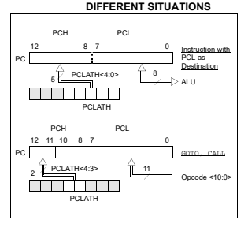
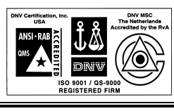

Implementing a Table Read

| Microchip Technology Inc.   |
|-----------------------------|

## Introduction

AN556
This application note shows how to implement a table look-up for the following devices: - PIC12CXXX - PIC12CEXXX - PIC16CXXX - PIC16CEXXX - PIC16FXXX The examples shown are for the PIC16CXXX family. An explanation of differences for the PIC16C5X family is at the end of this application note. To access data in program memory, a table read operation must be performed. The table consists of a series of retlw K instructions where, the 8-bit table constants are assigned to the literal K. The first instruction in the table computes the offset to the table by using addwf PCL,F and consequently, the program branches to the appropriate retlw K instruction
(Example 1).

## Example 1:

.

.

movlw offset ;load offset in w reg call Table
. .

.

Table:
addwf PCL,F ;add offset to pc to 
;generate a computed goto retlw 'A' ;return the ASCII char A retlw 'B' ;return the ASCII char B
retlw 'C' ;return the ASCII char C
. .

.

The method is straight forward, however, certain precautions have to be exercised when doing a table read in the PIC16CXXX.

## Implementation Program Counter Loading

The Program Counter (PC) in the PIC16CXXX is 13bits wide. The low 8-bits (PCL) are mapped in RAM at location 02h and are directly readable and writable. The high 5-bits are not accessible directly and can only be written through the PCLATH register (Figure 1). The PCLATH register is a R/W register with only five of its bits implemented <4:0>, all other bits read as '0'.

FIGURE 1: LOADING OF PC IN 

## Section 1 Call **And** Goto **Instructions**

When executing a CALL or GOTO, the low 11-bits are loaded directly from the instruction opcode. The high 2-bits are loaded from bits 3 and 4 of the PCLATH register. It is a good practice to pre-load PCLATH with the high byte of the routine's address before executing the routine. This can be done as follows:

EXAMPLE 2:

. . movlw HIGH Table ;load high 8-bit 

;address of Table

movwf PCLATH ;into PCLATH call Routine ;execute Call 

;instruction

. .

## Computed Goto **Instruction**

Any instruction with PCL as the destination, will load the PCH with the 5 low bits from the PCLATH (Figure 1). In Example 3, if the address where the CALL was made was on Page 0 and the address of the actual table was on Page 3, then when executing the computed GOTO, the program will go to a location in Page 0 instead of a location on Page 3. To prevent the program from branching to an unintended location when doing a table read, the PCLATH register should be pre-loaded with the high byte of the "Table" address. Example 3A shows how this can be done.

EXAMPLE 3:

.

org 0x80 ;code location in page 0

movlw offset ;load offset in w reg call Table

.

. org 0x0320 ;Table located in page 3

Table:

addwf PCL,F ;add offset to pc to 

;generate a computed goto

retlw 'A' ;return the ASCII char A retlw 'B' ;return the ASCII char B retlw 'C' ;return the ASCII char C . . .

EXAMPLE 3A:

org 0x80

movlw HIGH Table movwf PCLATH

movlw offset

call Table .

.

. org 0x320

Table:

addwf PCL,F retlw 'A'

retlw 'B'

. .

.

| Note:   | If the program memory size is less than 2K-words, then the above precaution is not necessary.   |
|---------|-------------------------------------------------------------------------------------------------|

When doing a computed GOTO for a table read, care should be taken about page boundaries. The ADDWF
PCL instruction will not compute a value greater than 8bits. In Example 4, the result of the computed GOTO will result in a branch to an unintended portion of the code for a value in offset greater than zero. The user either has to be cautious as to where in a page the Table resides or has to monitor page roll-over and add it to the PCLATH ahead of the computed GOTO. 

| PCL instruction will not compute a value greater than 8- bits. In Example 4, the result of the computed GOTO will result in a branch to an unintended portion of the code for a value in offset greater than zero. The user either has to be cautious as to where in a page the Table resides or has to monitor page roll-over and add it to the PCLATH ahead of the computed GOTO.   | org                                       | 0x80                                        |    |
|---------------------------------------------------------------------------------------------------------------------------------------------------------------------------------------------------------------------------------------------------------------------------------------------------------------------------------------------------------------------------------------|-------------------------------------------|---------------------------------------------|----|
| movlw                                                                                                                                                                                                                                                                                                                                                                                 | LOW Table                                 | ;get low 8 bits of ; address                |    |
| addwf                                                                                                                                                                                                                                                                                                                                                                                 | offset,F                                  | ;do an 8-bit add ; operation                |    |
| movlw                                                                                                                                                                                                                                                                                                                                                                                 | HIGH Table ;get high 5 bits of  ; address |                                             |    |
| btfsc                                                                                                                                                                                                                                                                                                                                                                                 | status,c                                  | ;page crossed?                              |    |
| addlw                                                                                                                                                                                                                                                                                                                                                                                 | 1                                         | ;yes then increment ; high address          |    |
| movwf                                                                                                                                                                                                                                                                                                                                                                                 | PCLATH                                    | ;load high address in ; latch               |    |
| movf                                                                                                                                                                                                                                                                                                                                                                                  | offset,w                                  | ;load computed offset ; in w reg            |    |
| call                                                                                                                                                                                                                                                                                                                                                                                  | Table                                     |                                             |    |
| . . org                                                                                                                                                                                                                                                                                                                                                                               | 0x9FD                                     |                                             |    |
| Table: movwf                                                                                                                                                                                                                                                                                                                                                                          | PCL,F                                     | ;load computed offset ; in PCL              |    |
| retlw                                                                                                                                                                                                                                                                                                                                                                                 | 'A'                                       | ;return the ASCII ; char A                  |    |
| retlw                                                                                                                                                                                                                                                                                                                                                                                 | 'B'                                       | ;return the ASCII ; char B                  |    |
| retlw                                                                                                                                                                                                                                                                                                                                                                                 | 'C'                                       | ;return the ASCII ; char C                  |    |
| . . .                                                                                                                                                                                                                                                                                                                                                                                 |                                           |                                             |    |
| EXAMPLE 4: . org 0x80                                                                                                                                                                                                                                                                                                                                                                 | ;code location in ; page 0                |                                             |    |
| movlw                                                                                                                                                                                                                                                                                                                                                                                 | HIGH Table ;load PCLATH with hi ; address |                                             |    |
| movwf                                                                                                                                                                                                                                                                                                                                                                                 | PCLATH                                    | ;                                           | /  |
| movlw                                                                                                                                                                                                                                                                                                                                                                                 | offset,F                                  | ;load offset in w reg                       |    |
| call                                                                                                                                                                                                                                                                                                                                                                                  | Table                                     |                                             |    |
| . . org                                                                                                                                                                                                                                                                                                                                                                               | 0x02ff                                    | ;Table located end of ; page 2              |    |
| Table: addwf                                                                                                                                                                                                                                                                                                                                                                          | PCL,F                                     | ;value in pc will not ; roll over to page 3 |    |
| retlw                                                                                                                                                                                                                                                                                                                                                                                 | 'A'                                       | ;return the ASCII ; char A                  |    |
| retlw                                                                                                                                                                                                                                                                                                                                                                                 | 'B'                                       | ;return the ASCII ; char B                  |    |
| retlw                                                                                                                                                                                                                                                                                                                                                                                 | 'C'                                       | ;return the ASCII ; char C                  |    |
| .                                                                                                                                                                                                                                                                                                                                                                                     | SECTION 2                                 |                                             |    |

## Implementation For The Pic16C5X Family

The PIC16C5X has no PCH or PCLATH register, so the user has to take into consideration all the precautions mentioned in Section 1. In the PIC16C5X, the location of the Table has to be in the top half of a 512 word page. This restriction is not valid for the PIC16CXXX family. To convert a table read operation from PIC16C5X code to the PIC16CXXX code, the following should be done: - Remove any program memory page select instructions (PIC16C56/57), if present. 

- Do a 13-bit computed GOTO operation (as shown in Example 5), when doing a table read operation.

## Note The Following Details Of The Code Protection Feature On Picmicro® Mcus.

- The PICmicro family meets the specifications contained in the Microchip Data Sheet. - Microchip believes that its family of PICmicro microcontrollers is one of the most secure products of its kind on the market today, when used in the intended manner and under normal conditions.

- There are dishonest and possibly illegal methods used to breach the code protection feature. All of these methods, to our knowledge, require using the PICmicro microcontroller in a manner outside the operating specifications contained in the data sheet. 

The person doing so may be engaged in theft of intellectual property.

- Microchip is willing to work with the customer who is concerned about the integrity of their code. - Neither Microchip nor any other semiconductor manufacturer can guarantee the security of their code. Code protection does not mean that we are guaranteeing the product as "unbreakable".

- Code protection is constantly evolving. We at Microchip are committed to continuously improving the code protection features of our product.

If you have any further questions about this matter, please contact the local sales office nearest to you. Information contained in this publication regarding device applications and the like is intended through suggestion only and may be superseded by updates. It is your responsibility to ensure that your application meets with your specifications.

No representation or warranty is given and no liability is assumed by Microchip Technology Incorporated with respect to the accuracy or use of such information, or infringement of patents or other intellectual property rights arising from such use or otherwise. Use of Microchip's products as critical components in life support systems is not authorized except with express written approval by Microchip. No licenses are conveyed, implicitly or otherwise, under any intellectual property rights.

## Trademarks

The Microchip name and logo, the Microchip logo, FilterLab, KEELOQ, microID, MPLAB, PIC, PICmicro, PICMASTER,
PICSTART, PRO MATE, SEEVAL and The Embedded Control Solutions Company are registered trademarks of Microchip Technology Incorporated in the U.S.A. and other countries.

dsPIC, ECONOMONITOR, FanSense, FlexROM, fuzzyLAB,
In-Circuit Serial Programming, ICSP, ICEPIC, microPort, Migratable Memory, MPASM, MPLIB, MPLINK, MPSIM,
MXDEV, PICC, PICDEM, PICDEM.net, rfPIC, Select Mode and Total Endurance are trademarks of Microchip Technology Incorporated in the U.S.A.

Serialized Quick Turn Programming (SQTP) is a service mark of Microchip Technology Incorporated in the U.S.A. All other trademarks mentioned herein are property of their respective companies. © 2002, Microchip Technology Incorporated, Printed in the U.S.A., All Rights Reserved.

 Printed on recycled paper.

Microchip received QS-9000 quality system certification for its worldwide headquarters, design and wafer fabrication facilities in Chandler and Tempe, Arizona in July 1999. The Company's quality system processes and procedures are QS-9000 compliant for its PICmicro® 8-bit MCUs, KEELOQ® *code hopping* devices, Serial EEPROMs and microperipheral products. In addition, Microchip's quality system for the design and manufacture of development systems is ISO 9001 certified.

## Worldwide Sales And Service

AMERICAS

Corporate Office

2355 West Chandler Blvd. Chandler, AZ 85224-6199

Tel: 480-792-7200 Fax: 480-792-7277

Technical Support: 480-792-7627 Web Address: http://www.microchip.com

Rocky Mountain

2355 West Chandler Blvd.

Chandler, AZ 85224-6199

Tel: 480-792-7966 Fax: 480-792-7456

Atlanta

500 Sugar Mill Road, Suite 200B

Atlanta, GA 30350

Tel: 770-640-0034 Fax: 770-640-0307

Boston

2 Lan Drive, Suite 120

Westford, MA 01886

Tel: 978-692-3848 Fax: 978-692-3821

Chicago

333 Pierce Road, Suite 180

Itasca, IL 60143

Tel: 630-285-0071 Fax: 630-285-0075

Dallas

4570 Westgrove Drive, Suite 160

Addison, TX 75001

Tel: 972-818-7423 Fax: 972-818-2924

Detroit

Tri-Atria Office Building 

32255 Northwestern Highway, Suite 190

Farmington Hills, MI 48334

Tel: 248-538-2250 Fax: 248-538-2260

Kokomo

2767 S. Albright Road 

Kokomo, Indiana 46902

Tel: 765-864-8360 Fax: 765-864-8387

Los Angeles

18201 Von Karman, Suite 1090

Irvine, CA 92612

Tel: 949-263-1888 Fax: 949-263-1338

New York

150 Motor Parkway, Suite 202

Hauppauge, NY 11788 Tel: 631-273-5305 Fax: 631-273-5335

San Jose

Microchip Technology Inc.

2107 North First Street, Suite 590

San Jose, CA 95131 Tel: 408-436-7950 Fax: 408-436-7955

Toronto

6285 Northam Drive, Suite 108

Mississauga, Ontario L4V 1X5, Canada

Tel: 905-673-0699 Fax: 905-673-6509

| ASIA/PACIFIC Australia Microchip Technology Australia Pty Ltd Suite 22, 41 Rawson Street Epping 2121, NSW Australia Tel: 61-2-9868-6733 Fax: 61-2-9868-6755 China - Beijing Microchip Technology Consulting (Shanghai) Co., Ltd., Beijing Liaison Office Unit 915 Bei Hai Wan Tai Bldg. No. 6 Chaoyangmen Beidajie  Beijing, 100027, No. China Tel: 86-10-85282100 Fax: 86-10-85282104 China - Chengdu Microchip Technology Consulting (Shanghai) Co., Ltd., Chengdu Liaison Office Rm. 2401, 24th Floor,  Ming Xing Financial Tower No. 88 TIDU Street Chengdu 610016, China Tel: 86-28-6766200 Fax: 86-28-6766599 China - Fuzhou Microchip Technology Consulting (Shanghai) Co., Ltd., Fuzhou Liaison Office Unit 28F, World Trade Plaza No. 71 Wusi Road Fuzhou 350001, China Tel: 86-591-7503506 Fax: 86-591-7503521 China - Shanghai Microchip Technology Consulting (Shanghai) Co., Ltd. Room 701, Bldg. B Far East International Plaza No. 317 Xian Xia Road Shanghai, 200051 Tel: 86-21-6275-5700 Fax: 86-21-6275-5060 China - Shenzhen Microchip Technology Consulting (Shanghai) Co., Ltd., Shenzhen Liaison Office Rm. 1315, 13/F, Shenzhen Kerry Centre, Renminnan Lu Shenzhen 518001, China Tel: 86-755-2350361 Fax: 86-755-2366086 Hong Kong Microchip Technology Hongkong Ltd. Unit 901-6, Tower 2, Metroplaza 223 Hing Fong Road Kwai Fong, N.T., Hong Kong Tel: 852-2401-1200 Fax: 852-2401-3431 India Microchip Technology Inc. India Liaison Office Divyasree Chambers 1 Floor, Wing A (A3/A4) No. 11, O'Shaugnessey Road Bangalore, 560 025, India Tel: 91-80-2290061 Fax: 91-80-2290062   |
|----------------------------------------------------------------------------------------------------------------------------------------------------------------------------------------------------------------------------------------------------------------------------------------------------------------------------------------------------------------------------------------------------------------------------------------------------------------------------------------------------------------------------------------------------------------------------------------------------------------------------------------------------------------------------------------------------------------------------------------------------------------------------------------------------------------------------------------------------------------------------------------------------------------------------------------------------------------------------------------------------------------------------------------------------------------------------------------------------------------------------------------------------------------------------------------------------------------------------------------------------------------------------------------------------------------------------------------------------------------------------------------------------------------------------------------------------------------------------------------------------------------------------------------------------------------------------------------------------------------|

| Japan Microchip Technology Japan K.K. Benex S-1 6F 3-18-20, Shinyokohama Kohoku-Ku, Yokohama-shi Kanagawa, 222-0033, Japan Tel: 81-45-471- 6166 Fax: 81-45-471-6122 Korea Microchip Technology Korea 168-1, Youngbo Bldg. 3 Floor Samsung-Dong, Kangnam-Ku Seoul, Korea 135-882 Tel: 82-2-554-7200 Fax: 82-2-558-5934 Singapore Microchip Technology Singapore Pte Ltd. 200 Middle Road #07-02 Prime Centre Singapore, 188980 Tel: 65-334-8870 Fax: 65-334-8850 Taiwan Microchip Technology Taiwan 11F-3, No. 207 Tung Hua North Road Taipei, 105, Taiwan Tel: 886-2-2717-7175 Fax: 886-2-2545-0139   |
|-------------------------------------------------------------------------------------------------------------------------------------------------------------------------------------------------------------------------------------------------------------------------------------------------------------------------------------------------------------------------------------------------------------------------------------------------------------------------------------------------------------------------------------------------------------------------------------------------------|

| EUROPE Denmark Microchip Technology Nordic ApS Regus Business Centre Lautrup hoj 1-3 Ballerup DK-2750 Denmark Tel: 45 4420 9895 Fax: 45 4420 9910 France Microchip Technology SARL Parc d'Activite du Moulin de Massy 43 Rue du Saule Trapu Batiment A - ler Etage 91300 Massy, France Tel: 33-1-69-53-63-20 Fax: 33-1-69-30-90-79 Germany Microchip Technology GmbH Gustav-Heinemann Ring 125 D-81739 Munich, Germany Tel: 49-89-627-144 0 Fax: 49-89-627-144-44 Italy Microchip Technology SRL Centro Direzionale Colleoni  Palazzo Taurus 1 V. Le Colleoni 1 20041 Agrate Brianza Milan, Italy  Tel: 39-039-65791-1 Fax: 39-039-6899883 United Kingdom Arizona Microchip Technology Ltd. 505 Eskdale Road Winnersh Triangle Wokingham  Berkshire, England RG41 5TU Tel: 44 118 921 5869 Fax: 44-118 921-5820   |
|-------------------------------------------------------------------------------------------------------------------------------------------------------------------------------------------------------------------------------------------------------------------------------------------------------------------------------------------------------------------------------------------------------------------------------------------------------------------------------------------------------------------------------------------------------------------------------------------------------------------------------------------------------------------------------------------------------------------------------------------------------------------------------------------------------------------|
