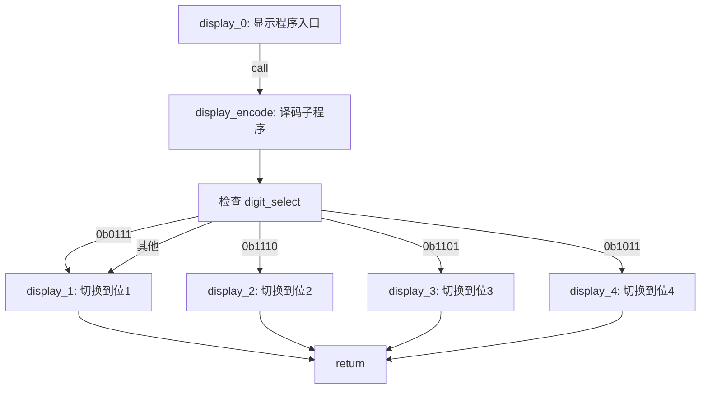
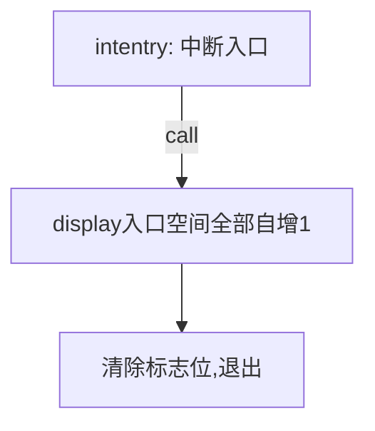
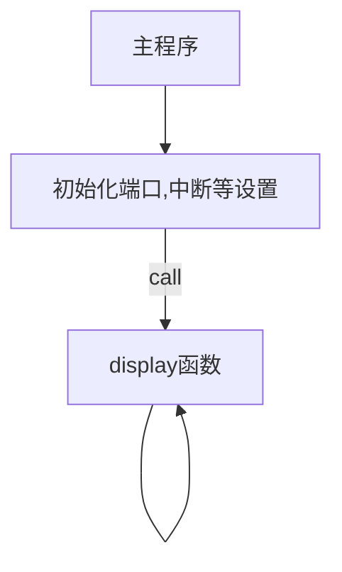

```mermaid
graph TD
    A[display_0: 显示程序入口] -->|call| B[display_encode: 译码子程序]
    B --> C[检查 digit_select]
    C -->|0b0111| D[display_1: 切换到位1]
    C -->|0b1110| E[display_2: 切换到位2]
    C -->|0b1101| F[display_3: 切换到位3]
    C -->|0b1011| G[display_4: 切换到位4]
    C -->|其他| D
    
    D --> H[return]
    E --> H[return]
    F --> H[return]
    G --> H[return]

```

```mermaid
graph TD
    A[intentry: 中断入口]
    A -->|call| B[display入口空间全部自增1]
    B -->C[清除标志位,退出]

```

```mermaid
graph TD
A[主程序] --> B[初始化端口,中断等设置]
B -->|call| C[display函数]
C --> C
```
00A8 - 0014
168 - 20 = 148

139 -> 148