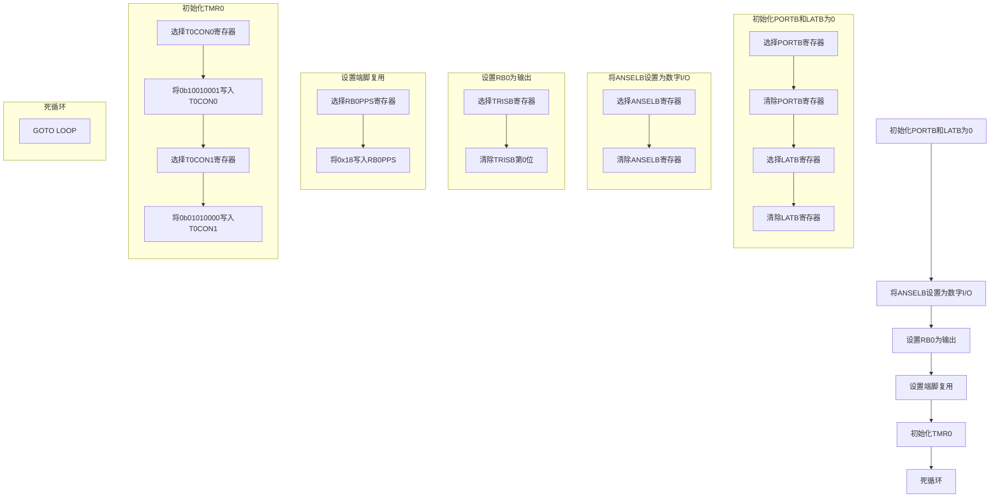
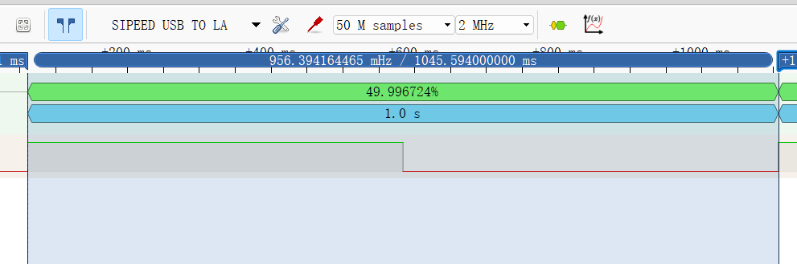

## 定时器闪灯思路

###### 王一赫

###### 组员 : 史少博,王一赫

### 数学计算与逻辑推导


> **27.7 Timer0 Output**
>
> The Timer0 output can be routed to any I/O pin via the RxyPPS output selection register (see **Section 13.0** **“Peripheral Pin Select (PPS) Module”** for additional information). The Timer0 output can also be used by other peripherals, such as the Auto-conversion Trigger of the Analog-to-Digital Converter. Finally, the Timer0output can be monitored through software via the Timer0 output bit (T0OUT) of the T0CON0 register (Register 27-1).
>
> TMR0_out will be one postscaled clock period when a match occurs between TMR0L and TMR0H in 8-bit mode, or when TMR0 rolls over in 16-bit mode. The Timer0 output is a 50% duty cycle that **toggles on each TMR0_out rising clock edge.**

toggles on each TMR0_out rising clock edge意味着在原时钟信号经过一系列分频之后的输出信号,在上升沿使得我们的所需信号反转,即分频使得频率增倍

期望的gpio输出是1Hz的正方波,则我们的分频器out应该是2Hz
为了简化计算,以及贴合数字电路特点,我们选择求$\log_2$
$$
\log_2(10^6)=18.931
$$
考虑到内频率比4,FOSC/4接入定时器作为工作信号
$$
\log_2(10^6) - 2 =16.931
$$
目前仍然大于16(16位计数器分频能力),仍需降低频率,故选择预分频1:1,后分频选择1:2使得尽可能贴近2Hz
基于以上,计算实际的频率
$$
\frac{1MHz}{2^{20}} = 0.953673 Hz
$$
根据计算,输出频率为953.673mhz
与1hz差4.6%

### 仿真与结果展示


[ipynb](rel3.ipynb)


根据以上分析与计算
$$
T0CON0=0b10001000\\
T0CON1=0b01010110\\
预置TMR0 High Byte\\
217 - 1 = 215
$$


### 代码框架与流程梳理




### 实验结果观察与结果验证


$$
|\frac{0.956394164465}{0.95367431640625}-1|*100\% =2.95\%
$$
属于时钟误差范围(如下图)及逻辑分析仪(廉价物品,没有给精确度,但是私认为数据可信)误差范围


### 代码

```asm
#include <xc.inc>

/** @brief 配置和初始化段 */
psect   init, class=CODE, delta=2
psect   end_init, class=CODE, delta=2
psect   powerup, class=CODE, delta=2
psect   cinit, class=CODE, delta=2
psect   functab, class=ENTRY, delta=2
psect   idloc, class=IDLOC, delta=2, noexec
psect   eeprom_data, class=EEDATA, delta=2, space=3, noexec
psect   intentry, class=CODE, delta=2
psect   reset_vec, class=CODE, delta=2

/** @brief 全局定义 */
global _main, reset_vec, start_initialization

/** @brief 配置设置 */
psect config, class=CONFIG, delta=2
    dw    0xDFEC
    dw    0xF7FF
    dw    0xFFBF
    dw    0xEFFE
    dw    0xFFFF
    
/** @brief 复位向量，跳转到主函数 */
psect reset_vec
reset_vec:
    ljmp    _main

/** @brief 初始化段 */
psect cinit
start_initialization:

/** @brief 公共变量 */
psect CommonVar, class=COMMON, space=1, delta=1
char_case: ds 1  /**< @brief 字符变量 */


/** @brief 中断服务程序向量 */
psect intentry
intentry:
    retfie

/** @brief 主代码段 */
psect main, class=CODE, delta=2

global _main

/** @def RP0
 *  @brief 寄存器页0
 */
#define RP0 5
/** @def RP1
 *  @brief 寄存器页1
 */
#define RP1 6

/**
 * @brief 主函数
 *
 * 该函数初始化微控制器，设置I/O端口
 * 初始化定时器0，设置定时器0实现0.5s延时
 */
_main:
    /** 初始化PORTB和LATB为0 */
    BANKSEL PORTB
    CLRF    PORTB
    BANKSEL LATB
    CLRF    LATB

    /** 将ANSELB设置为数字I/O（默认是模拟） */
    BANKSEL ANSELB
    CLRF    ANSELB

    /** 设置RB0为输出 */
    BANKSEL TRISB
    BCF     TRISB, 0

    /** 设置端脚复用*/
    BANKSEL RB0PPS
    MOVLW   0x18//TMR0=0x18
    MOVWF   RB0PPS

    /** 初始化time 0*/
    //T0CON0=1xx10001
    //T0CON1=01010010
    BANKSEL T0CON0
    MOVLW   0b10010001 // T0CON0配置
    MOVWF   T0CON0
    BANKSEL T0CON1
    MOVLW   0b01010000 // T0CON1配置
    MOVWF   T0CON1

    //死循环
    LOOP:
        GOTO    LOOP

    END
```
